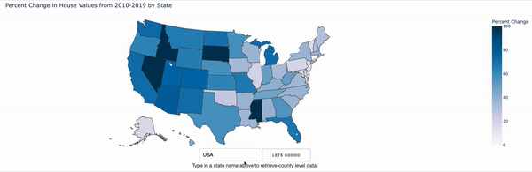
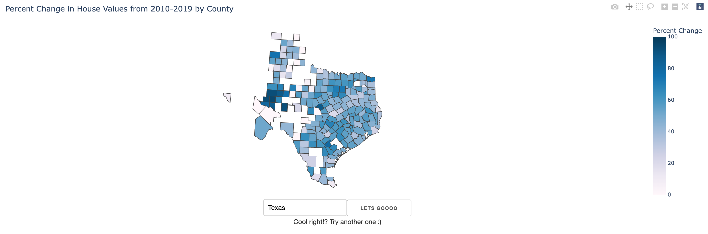

# **Housing Price Change**
## *Python Application displaying Percentage Change in Housing Prices from 2010-2019*
### Enter a State (capitalized) to get started!
<iframe src="https://house-price-choro.herokuapp.com/" height="570" width="100%" frameBorder="10"></iframe>

This application (above) is a collection of Python Scripts myself and my colleagues have made to visualize trends in the US real estate market. The pricing information was gathered from data made publicly available from Zillow, and the population information was gathered from the US census. These data sets were cleaned and merged to compute percentage changes (both year-on-year and aggregated for the decade) at the state and county level (done mostly with base Python and Pandas). Then using Plotly, we visualized these trends using choropleth maps. Finally, we turned these Python scripts into webapps using Dash, and hosted them using Heroku to display on this Github Pages site.  
*(The choropleths, especially the median house price ones, do take a while to load as they have to render a lot of data using the relatively low-load system provided to us by Heroku)*  




## Collaborators:  
Amal Kadri: https://github.com/amal-kadri  
Parker Gauthier: https://github.com/parkergauthier  
Jonathan Bowman https://github.com/bowman-jonathan  
Elle Boodsakorn: https://github.com/khun-elle  
Haokun Zhang: https://github.com/haokunz  
Kevin O’Connor: https://github.com/k-oconnor  
Karlo Vlahek: https://github.com/KarloVlahek

`ignore the rest of the text on this site for now`  
`******************************************************************`  
You can use the [editor on GitHub](https://github.com/amal-kadri/Housing_Price_Choropleth/edit/gh-pages/index.md) to maintain and preview the content for your website in Markdown files.

Whenever you commit to this repository, GitHub Pages will run [Jekyll](https://jekyllrb.com/) to rebuild the pages in your site, from the content in your Markdown files.

### Markdown

Markdown is a lightweight and easy-to-use syntax for styling your writing. It includes conventions for

```markdown
Syntax highlighted code block

# Header 1
## Header 2
### Header 3

- Bulleted
- List

1. Numbered
2. List

**Bold** and _Italic_ and `Code` text

[Link](url) and 
```

For more details see [Basic writing and formatting syntax](https://docs.github.com/en/github/writing-on-github/getting-started-with-writing-and-formatting-on-github/basic-writing-and-formatting-syntax).

### Jekyll Themes

Your Pages site will use the layout and styles from the Jekyll theme you have selected in your [repository settings](https://github.com/amal-kadri/Housing_Price_Choropleth/settings/pages). The name of this theme is saved in the Jekyll `_config.yml` configuration file.

### Support or Contact

Having trouble with Pages? Check out our [documentation](https://docs.github.com/categories/github-pages-basics/) or [contact support](https://support.github.com/contact) and we’ll help you sort it out.
